# IT-Department-WordPress-2022-Project

## Overview
Understanding the requirement for the IT department website, managing the team to achieve the goal, developing the website, debugging the website, and deploying the website. This repository will consist of
- it-department.WordPress.2023-04-02.xml

## Tools
- WordPress
- Asana

## Plugins WordPress installed.
- Starter Templates
- Elementor
- WPForms
- UpdraftPlus
- etc.

**There are around 7 pages on the website, the images below show a sample of the website, and there is also a link to the website below.**

<h1 style="text-align: center;">Home Page</h1>

 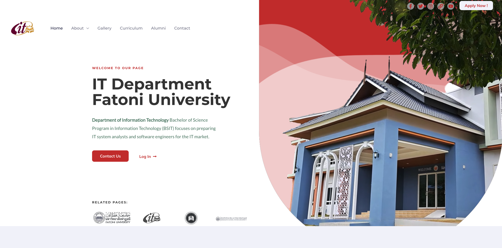 

 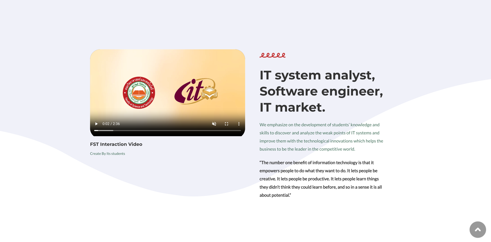 

 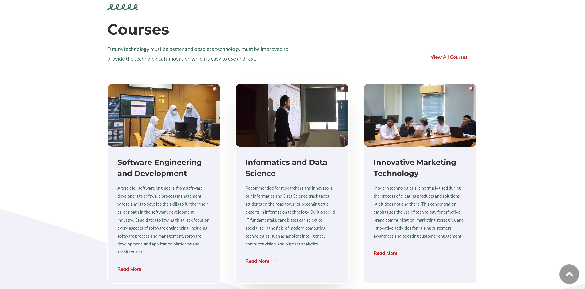 

 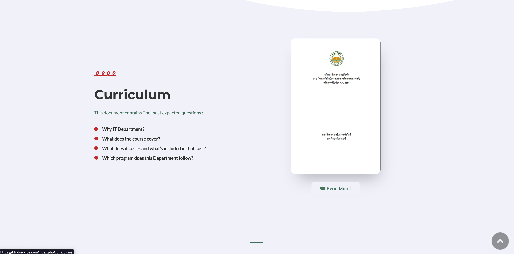 

 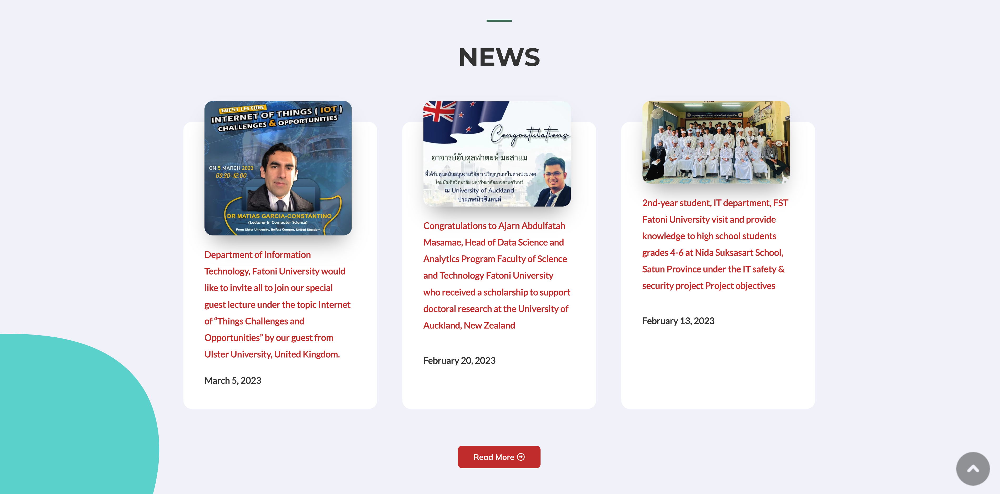 

  

 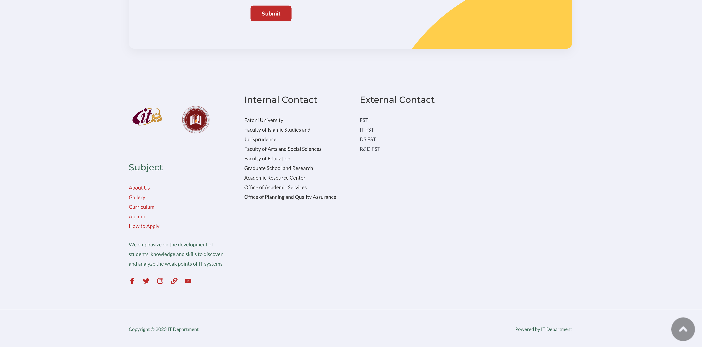 

<h1 style="text-align: center;">About History Page</h1>

  

 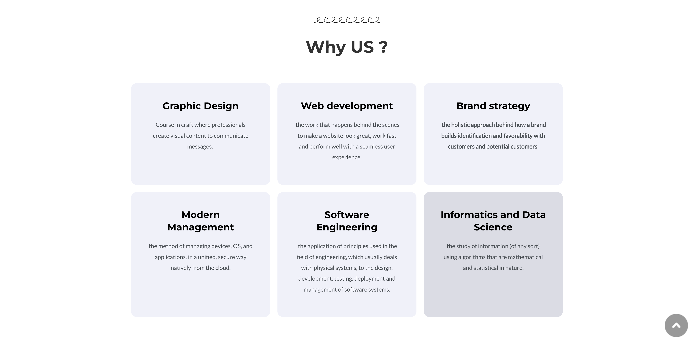 

 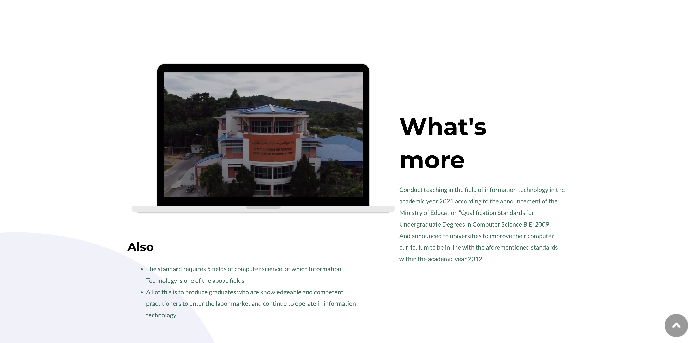 

<h1 style="text-align: center;">Administrative Structure Page</h1>

 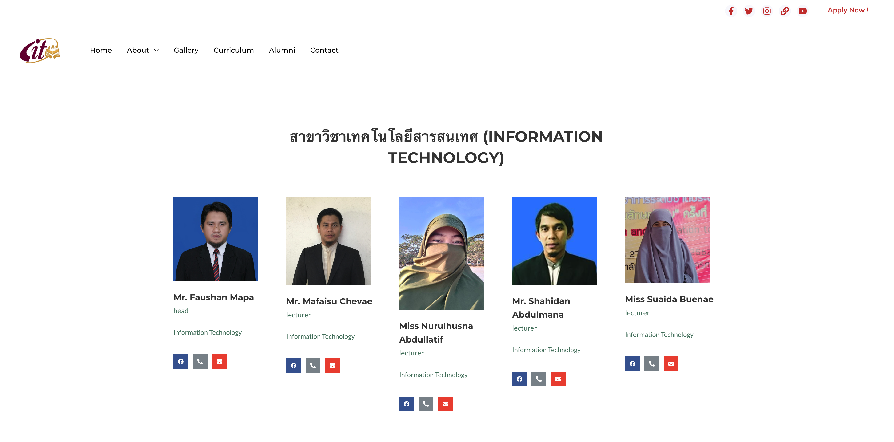 

<h1 style="text-align: center;">Gallery Page</h1>

 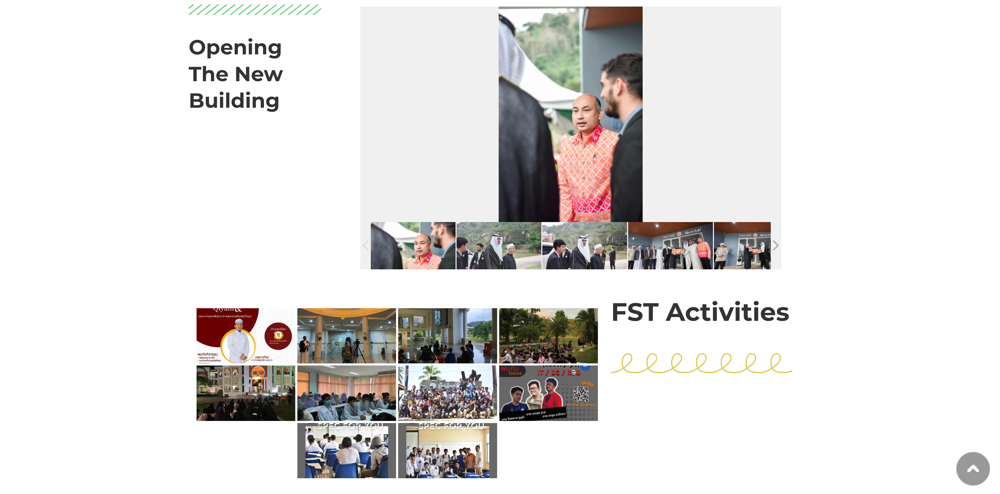 

  

 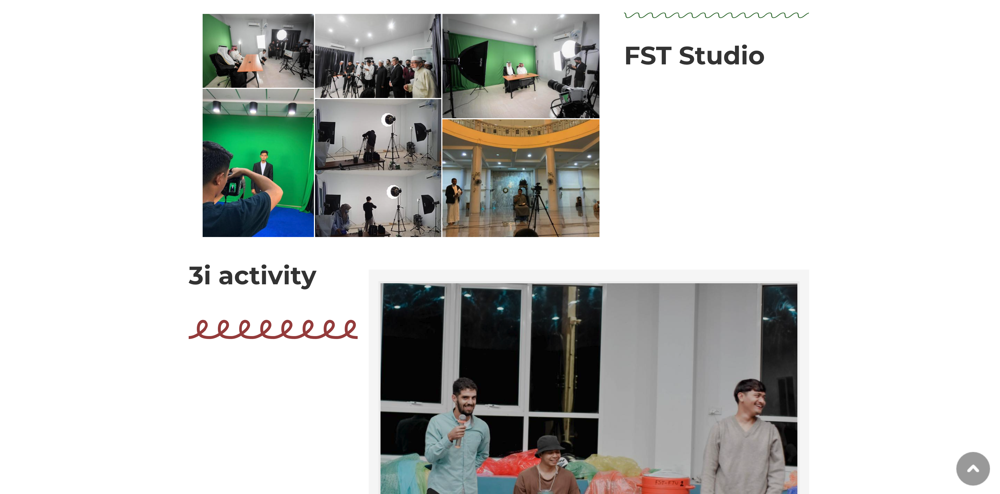 

 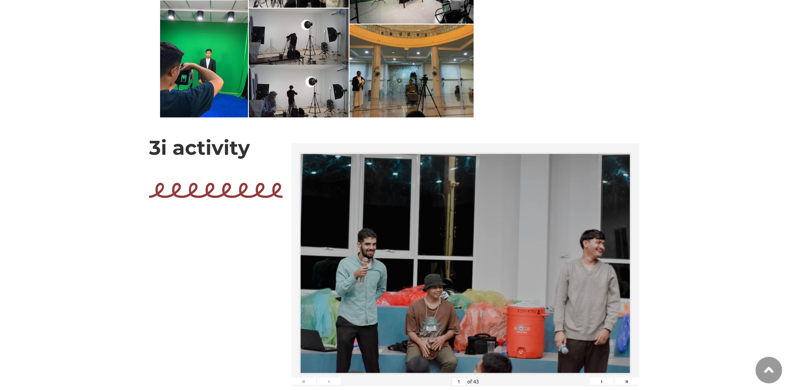 

<h1 style="text-align: center;">Curriculum Page</h1>

 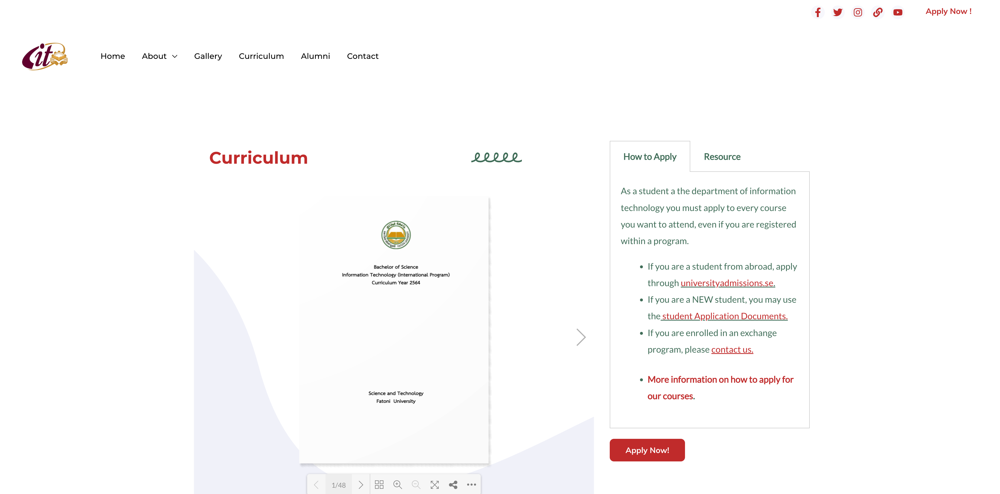 

<h1 style="text-align: center;">Alumni Page</h1>

 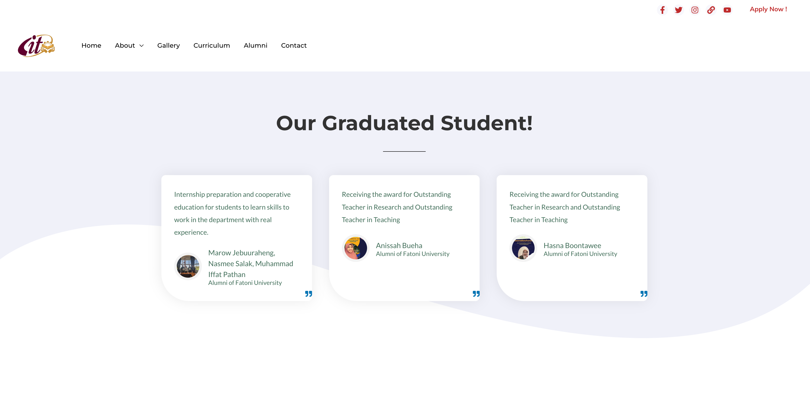 

  

  

<h1 style="text-align: center;">Contact Page</h1>

 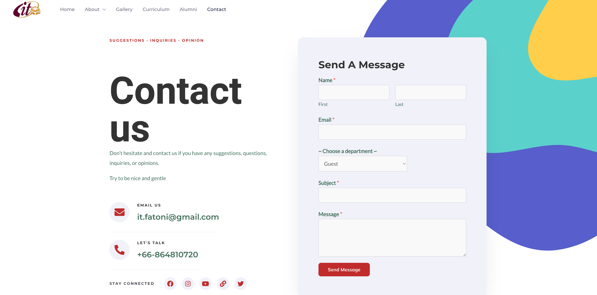 

 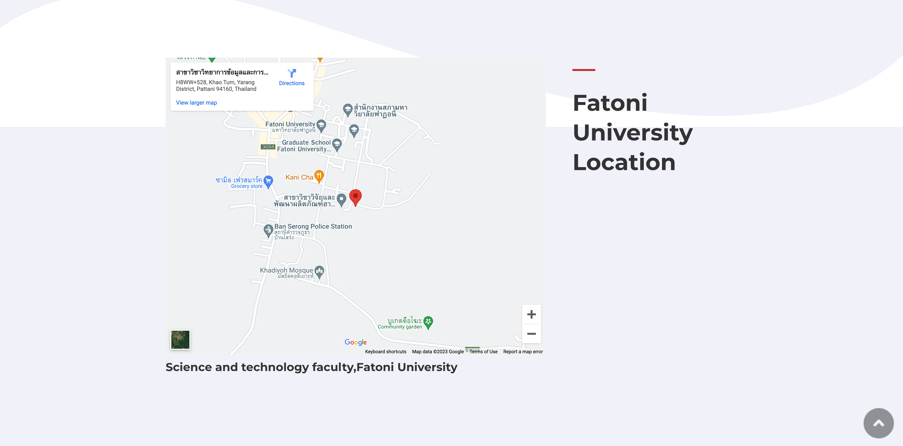 

## Author
- Lubnan Samae
- Azzam Jehtarhe
- Ahmad Waebeusar
- Khaled Muhammadtayuddin WangBuesa
- Yaser Abulkhair
- Hilmi Arwaekachi
- Mohammed Ahmed Mohammed Obaid
- Amal Kalaepeh
- Seereen Pongyeela
- Rana Lordeng

## Supervisor
- Faosan Mapa

# Link to the Website
## https://it.fndservice.com/
